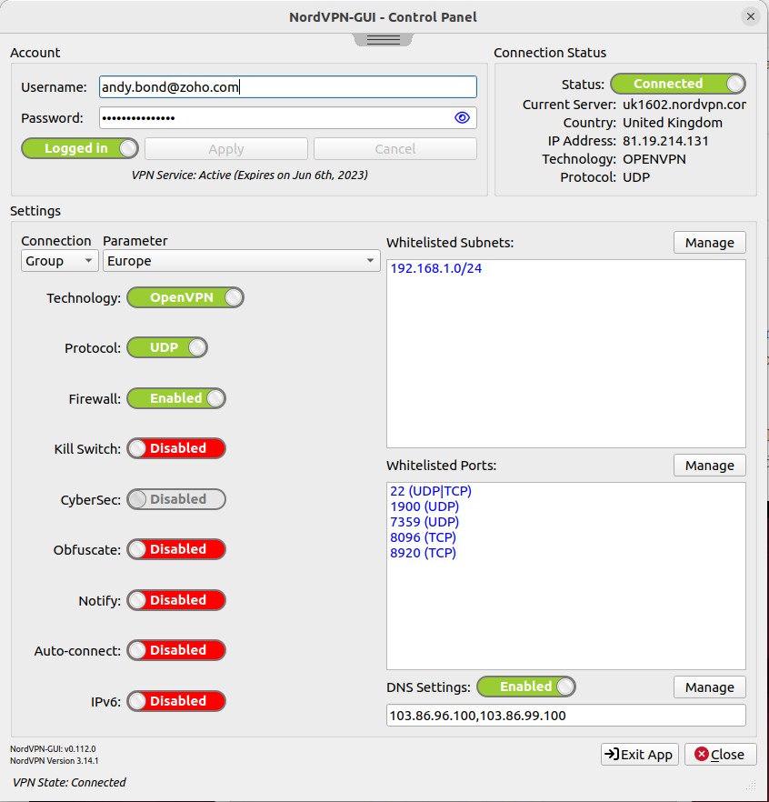

# Description

GUI for Linux NordVPN App

This software has been written and tested using Ubuntu. It is provided with No Guarantees or Warranties of any kind, expressed or implied. All versions should be considered as being in Perpetual beta.

The author specifically disclaims all implied warranties of any kind or nature, including any implied warranty of merchantability and/or any implied warranty of fitness for a particular purpose.

# Dependancies

- A working installation of the nordvpn app

- qtbase5-dev (>= 5.15.2)

# Features

**Detect if nordvpn app is installed**

**Icon which appears topmost on the desktop and provides:**

- Indication of VPN Connectivity
- Ability to be relocated as desired by dragging with mouse.
- Position is retained on application closure
- Right click menu options-
  * Connect/Disconnect to VPN
  * Open Control Panel
  * Quit

**Control Panel which provides**

- The means to enter Username & Password
- Connection status information
- Ability to Login/out from NordVPN
- Display of Version of NordVPN App and NordVPN-GUI App
- Ability to control VPN Connection
  * Any
  * By Group
  * By Country
- Display of Account Expiry
- Pulldown display of command history
- Display and Control/Management of the following settings*
  * Technology
  * Protocol
  * Firewall
  * Kill Switch
  * Cybersec
  * Obfuscate
  * Notify
  * Autoconnect
  * IPv6
  * DNS
  * Whitelists (Ports & Subnets)

**Supported nordvpn app commands**

- status
- set
- settings
- connect
- disconnect
- whitelist
- login
- countries
- version
- account

# Licence

Code is licenced under the [GNU GENERAL PUBLIC LICENSE Version 3](LICENCE) unless otherwise stated.

Fontawesome is licenced under the [Font Awesome Free License](resources/fontawesome-free-6.0.0-desktop/LICENCE.txt)
